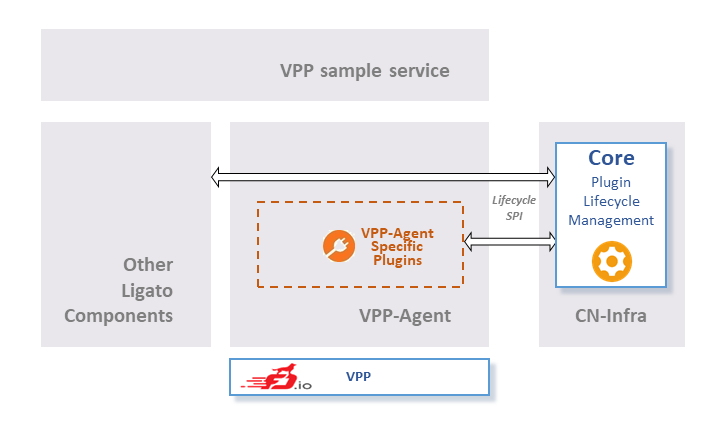

# VPP sample service
[](https://travis-ci.org/ligato/vpp-sample-service)
[](https://coveralls.io/github/ligato/vpp-sample-service?branch=master)
[](https://goreportcard.com/report/github.com/ligato/vpp-sample-service)
[](https://godoc.org/github.com/ligato/vpp-sample-service)
[](https://github.com/ligato/vpp-sample-service/blob/master/LICENSE)

The VPP sample service showcases the extensibility of the [VPP Agent](https://github.com/ligato/vpp-agent). The VPP Agent repository has its own examples
but this dedicated repository demonstrates the usage of the VPP Agent as [dependency](https://github.com/Masterminds/glide). This enables us to demostrate also interconnections of the VPP Agent with other Ligato components (i.e. [BGP Agent](https://github.com/ligato/bgp-agent)).
Use this repository as skeleton for your software projects (copy&paste it at the very beginning).



The sample service repository contains:
* [vpp l3 bgp routes](examples/vpp_l3_bgp_routes) - minimalistic fusion of the VPP Agent and the BGP Agent that configures the VPP according to the BGP-learned IPv4 routes


## Quickstart
### First project setup steps
For the basic steps to setup a project you can follow the [quickstart from cn-sample-service repository](https://github.com/ligato/cn-sample-service#quickstart).
You will need the VPP Agent dependency (optionally also the BGP Agent dependency) for your `glide.yaml` file:
```yaml
package: github.com/ligato/vpp-sample-service
import:
- package: github.com/ligato/vpp-agent
  version: 8b61778490fa4a22df294b0682c13e39b8f51869
- package: github.com/ligato/bgp-agent
  version: eb9cda59c6c44b8c6e51e8bcc3f738a15c714983  
```
VPP Agent already contains the [cn-infra](https://github.com/ligato/cn-infra) dependency.

### Run Examples
If you are more interested in examples, you can run them all just by using the makefile in the root of the repository:
```
make run-examples
```
The command pulls needed docker images from [Dockerhub](https://hub.docker.com/r/ligato/), 
setups networking, builds the examples, runs them, validates their output and cleans after them.

Each example is explained in detail. You can check the [examples](examples) folder. 

## Documentation
GoDoc can be browsed [online](https://godoc.org/github.com/ligato/vpp-sample-service).

