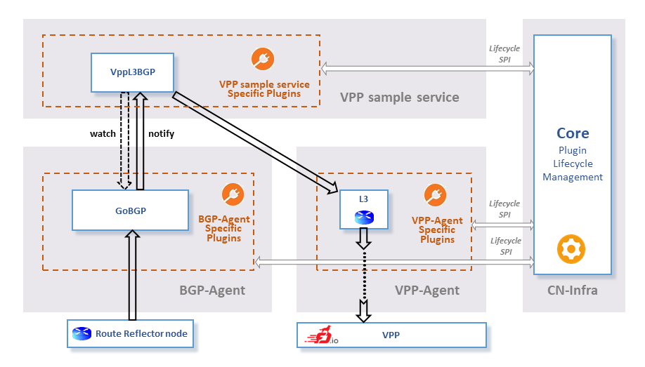
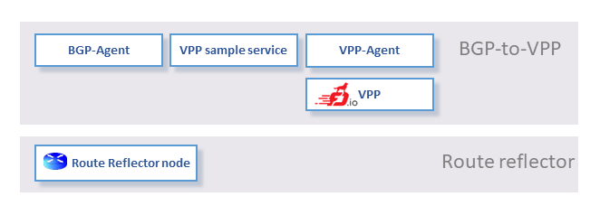

# VPP-L3-BGP routes example

The example demonstrates the capability to retrieve and transport the basic BGP information (prefix/next hop) from the BGP Route Reflector node to the VPP node. 
It also demonstates how to connect different Ligato components([VPP-Agent](https://github.com/ligato/vpp-agent), [BGP Agent](https://github.com/ligato/bgp-agent)) to achieve higher goals.

For quick setup and run of this and other examples you can use makefile:
```
make run-examples
```
For explanatory step-by-step procedure, keep reading.

### Architecture & Data flow


The example integrates together all needed parts to achieve the VPP configuration based on the BGP information. 
It combines the [VPP-L3-BGP plugin](../../plugins/vppl3bgp), the [VPP-Agent](https://github.com/ligato/vpp-agent)'s [L3 plugin](https://github.com/ligato/vpp-agent/tree/master/plugins/defaultplugins/l3plugin) and the [BGP-Agent](https://github.com/ligato/bgp-agent)'s [GoBGP plugin](https://github.com/ligato/bgp-agent/tree/master/bgp/gobgp). The `L3 plugin` is configured to connect to the VPP and the `GoBGP plugin` to connect to the Route Reflector node.

The data flow starts in the Route Reflector node, where we manually insert the new path into the [Route Reflector node](../../agent/route-reflector-gobgp-docker/README.md). Remote GoBGP plugin will be advertized about this new path via standard BGP protocol. Then this information will be translated to the API format that is exposed to all registered watchers of the `GoBGP plugin`. This translation is needed due to possible future plugins that can retrieve the BGP information using other frameworks(exaBGP, Quagga,...) and therefore in different formats. 

The `VPP-L3-BGP plugin` is registered as watcher client in the `GoBGP plugin` and will be notified about any new update. The `VPP-L3-BGP plugin` will translate this information into the VPP configuration structures provided by the `L3 plugin` inside the VPP-Agent. From there, the VPP-Agent will handle the rest of data flow down to the VPP.
### Infrastructure setup
To be able to run this example you must setup the infrastructure first. We will use docker containers. This is the docker containers architecture for this example:
 

It consist of the [BGP-to-VPP](../../docker/dev_bgp_to_vpp) docker container and the [Route reflector](https://github.com/ligato/bgp-agent/tree/master/docker/gobgp_route_reflector) docker container. In infrastructure setup we will only create images for these containers. 

At this point, it is expected that you have:
 * Installed the docker CE (docker engine version >=1.10). If you haven't please install it(for [ubuntu](https://docs.docker.com/engine/installation/linux/docker-ce/ubuntu/) or [other](https://docs.docker.com/engine/installation/)). 
 * Properly filled the [GOPATH environment variable](https://github.com/golang/go/wiki/Setting-GOPATH). Installing go is not necessary. 
 * Downloaded the [Ligato VPP sample service](https://github.com/ligato/vpp-sample-service). In case of installed go, just run:
```
go get github.com/ligato/vpp-sample-service
```
Change the path to the BGP-to-VPP docker folder
```
cd $GOPATH/src/github.com/ligato/vpp-sample-service/docker/dev_bgp_to_vpp
```
Build the BGP-to-VPP image
```
./build-image.sh
``` 
or pull already created image from [Dockerhub](https://hub.docker.com/r/ligato/dev-bgp-to-vpp/)
```
./pull-docker.sh
```
Change path to the Route reflector docker folder
```
cd $GOPATH/src/github.com/ligato/vpp-sample-service/vendor/github.com/ligato/bgp-agent/docker/gobgp_route_reflector
```
Build the Route reflector image
```
./build-image-routereflector.sh
```
(Note: Pulling the Route reflector image from [Dockerhub](https://hub.docker.com/r/ligato/gobgp-for-rr/) is possible too, but DockerHub version can differ from version needed for this example)

Now you should see something like this:

```
REPOSITORY              TAG                 IMAGE ID            CREATED             SIZE
ligato/gobgp-for-rr     v1.24               46711f3237ed        5 seconds ago       973MB
ligato/dev-bgp-to-vpp   v1.5                ee204db901fe        4 minutes ago       4.78GB
```
Process of building of the images has downloaded also other images that served as base images in the creation process. You can delete these base images if you want.

To be able to have static ip addresses for running docker images, we need to create separate network that can be used by docker.
```
./usage_scripts/create-ligato-network-for-docker.sh
```    
### Example run
We will need 4 linux terminals. To differentiate commands in terminal we will use different [prompt string](http://www.linuxnix.com/linuxunix-shell-ps1-prompt-explained-in-detail) for each terminal:

`[BGP-to-VPP/vpp-console]$` 

* The terminal for the VPP console inside the BGP-to-VPP docker container. We can interact with the VPP here, but also see its new log entries.

`[BGP-to-VPP/example-run]$`

* The terminal for Running go example inside the BGP-to-VPP docker container. 

`[route-reflector]$` 

* The terminal for running BGP server inside the Route reflector docker container that acts as a Route reflector. This terminal is also for adding the prefix/nexthop information directly to the BGP server(acting like Route reflector) in the Route reflector docker container. 

Lets run the example:

<b>1. Start the docker containers, VPP and BGP server.</b>

Change the directory so we can use the BGP-to-VPP docker helper scripts
```
[BGP-to-VPP/vpp-console]$ cd $GOPATH/src/github.com/ligato/vpp-sample-service/docker/dev_bgp_to_vpp/scripts
``` 
Start the BGP-to-VPP docker container
```
[BGP-to-VPP/vpp-console]$ ./start-bgp-to-vpp.sh
```
Start the VPP inside the BGP-to-VPP docker container
```
[BGP-to-VPP/vpp-console]$ ./start-vpp-interactive.sh
```
Switch to the ```[route-reflector]``` terminal and change the directory so that `start-routereflector.sh` script can find the gobgp configuration
```
[route-reflector]$ cd $GOPATH/src/github.com/ligato/vpp-sample-service
```
Start the route reflector docker container
```
[route-reflector]$ ./vendor/github.com/ligato/bgp-agent/docker/gobgp_route_reflector/usage_scripts/start-routereflector.sh gobgp-client-in-docker
```
<b>2. Run the go code example</b> 

Switch to the ```[BGP-to-VPP/example-run]$``` and change the directory so we can use the BGP-to-VPP docker helper scripts
```
[BGP-to-VPP/example-run]$ cd $GOPATH/src/github.com/ligato/vpp-sample-service/docker/dev_bgp_to_vpp/scripts
``` 
Run the go example (it will be build automatically before running)
```
[BGP-to-VPP/example-run]$ ./run_vpp_l3_bgp_routes_example.sh
```
(Note: The run of the example will take short time to compile and when running it will initially take some time, ~20 seconds, to receive the first BGP information due to the session initialization)

<b>3. Add new route information to the Route reflector</b>
Switch to the ```[route-reflector]``` terminal and change the directory so we can use the route reflector docker helper scripts
```
[route-reflector]$ cd $GOPATH/src/github.com/ligato/vpp-sample-service/vendor/github.com/ligato/bgp-agent/docker/gobgp_route_reflector/usage_scripts/
``` 
Connect to the bash console inside the Route reflector docker container
```
[route-reflector]$ ./connect-to-routereflector.sh
```
Add new prefix(`101.0.0.0/24`)/nexthop(`192.168.1.1`) information to the Route reflector
```
[route-reflector]$ gobgp global rib add -a ipv4 101.0.0.0/24 nexthop 101.0.10.1
``` 
(Note: `192.168.1.1` is the IP address of the VPPs virtual interface)

<b>4. Verify that the prefix/nexthop information did arrive in the VPP</b>
Switch back to the `[BGP-to-VPP/vpp-console]` and list in the VPP console the appropriate configuration (IP Fib configuration)
```
[BGP-to-VPP/vpp-console]$ vpp> show ip fib
```
You should see something like this:
```
...
101.0.0.0/24
  unicast-ip4-chain
  [@0]: dpo-load-balance: [proto:ip4 index:13 buckets:1 uRPF:12 to:[0:0]]
    [0] [@10]: dpo-load-balance: [proto:ip4 index:12 buckets:1 uRPF:8 to:[0:0]]
          [0] [@3]: arp-ipv4: via 101.0.10.1 memif0/1
...          
```
Additionally, you can check also the go runtime logs for adding prefix/nexthop in the `[BGP-to-VPP/example-run]` terminal. You should see somthing like this:
```
DEBU[0030] SendStaticRouteToVPP &{65001 101.0.0.0/24 101.0.10.1}  loc="vppl3bgp/plugin.go(55)" logger=bgptol3example tag=00000000
INFO[0030] Creating new route 101.0.0.0/24 -> 101.0.10.1  loc="l3plugin/route_config.go(67)" logger=defaultLogger tag=00000000
INFO[0030] Route 101.0.0.0/24-101.0.10.1 registered      loc="l3plugin/route_config.go(92)" logger=defaultLogger tag=00000000
```